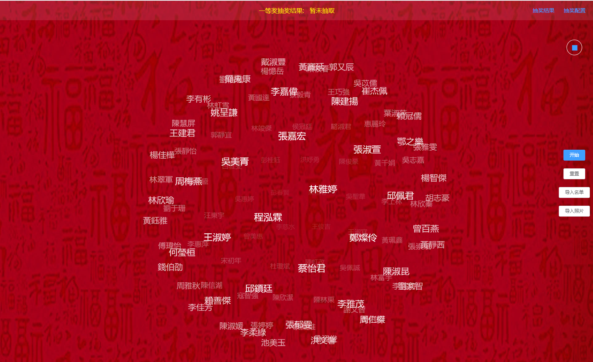
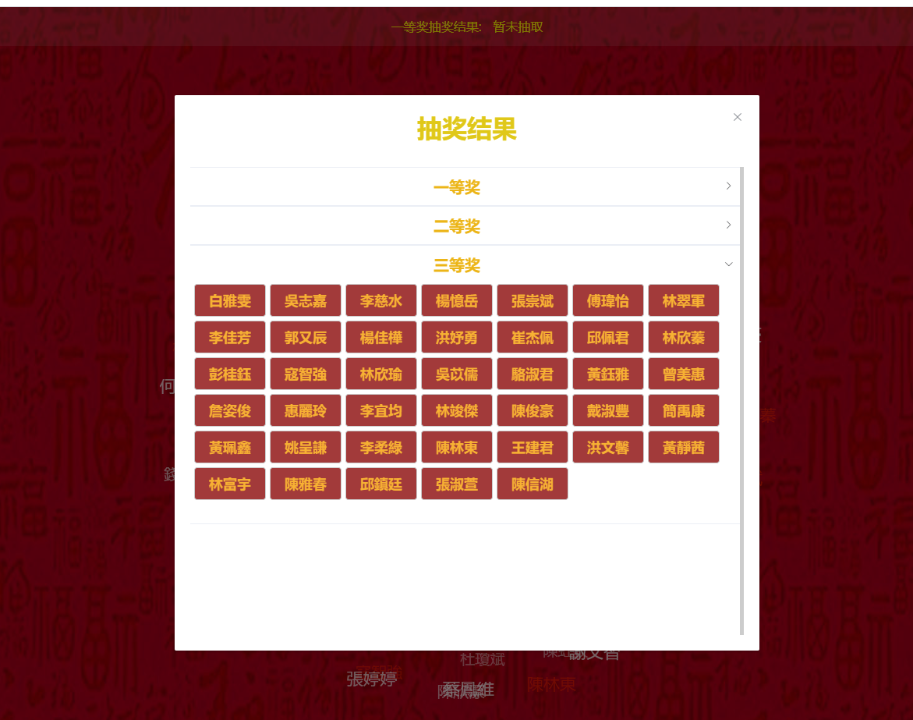
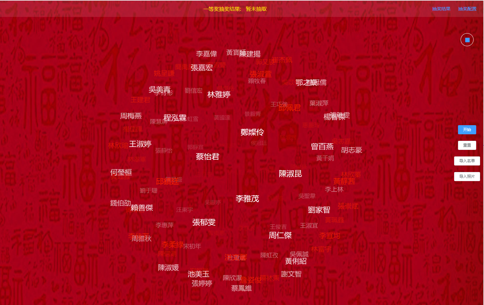

## 年会抽奖程序

基于 [lucky-draw](https://github.com/vitozyf/lucky-draw) 修改的抽奖程序 [mylucky.draw](https://github.com/linkypi/mylucky.draw)， 该项目是 [mylucky.draw](https://github.com/linkypi/mylucky.draw) 的electron版本，使用 electron-vue 技术。程序源码在 \src\renderer 中实现。
#### 修改内容有

- 导入名单完成后，将抽奖总人数设置为当前名单总人数
- 点击停止后的抽奖结果及查询抽奖结果时，将原有的编码改为姓名，方便用户观看
- 点击停止后的抽奖结果及查询抽奖结果页面调整容器为上下滚动，
  并适应当前窗口，防止其超出页面窗口
- 修改页面背景，改为红色背景
- 头部抽奖结果的滚动条显示同样将编码改为对应用户姓名，方便观看
- 将主色调改为金黄色


### 截图








#### Build Setup

``` bash
# install dependencies
npm install

# serve with hot reload at localhost:9080
npm run dev

# build electron application for production
npm run build


```

---

This project was generated with [electron-vue](https://github.com/SimulatedGREG/electron-vue)@[45a3e22](https://github.com/SimulatedGREG/electron-vue/tree/45a3e224e7bb8fc71909021ccfdcfec0f461f634) using [vue-cli](https://github.com/vuejs/vue-cli). Documentation about the original structure can be found [here](https://simulatedgreg.gitbooks.io/electron-vue/content/index.html).
